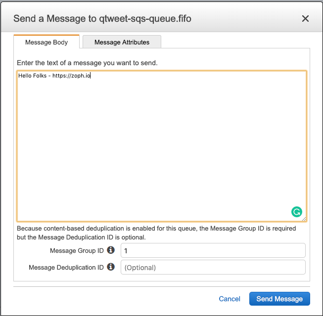

# :speaker: qmasto

Dead simple AWS SQS to Mastodon serverless speaker :speaker:.

> Publish message :love_letter: to SQS (FIFO), Lambda function will handle publishing it to Mastodon. Automagically. :tada:

To be honest, my plan is to automate the toots of certain information using this queue in multiple side projects.

As usual, I'm sharing this with you folks as I was not able to find equivalent in Github / Open source projects. I hope it could be useful to someone else.

## Getting started

> Update variables in `Makefile` and `tf/variables.tf` according to your environment.

- type `make` to get started (help)

### Requirements

1. AWS Account
2. Mastodon Access Token
3. Terraform

### How to deploy on your AWS Account

- `make all` (all-in-one command)

#### Manual - Under the hood (for Plumbers)

1. `make tf-package` (create the artifact and push to S3)
2. `make tf-init` (to prepare terraform deployment)
3. `make tf-apply` Deploy the infrastructure

_nb: Terraform is using remote state on S3._

#### Setup Mastodon secrets

After you've deployed the Terraform you will need to set Mastodon API Keys manually to AWS Secret Manager using AWS console.

Set the following credentials in AWS Secret Manager: `AccessToken`

### How to publish a message

#### Using AWS Console



#### Using AWSCLI

`aws sqs send-message --queue-url https://sqs.us-east-1.amazonaws.com/80398EXAMPLE/MyQueue --message-body "Hello Folks!" --delay-seconds 10 --message-attributes file://send-message.json`

[AWS Documentation](https://docs.aws.amazon.com/cli/latest/reference/sqs/send-message.html)

#### Using Python (boto3)

```python
import boto3

# Create SQS client
sqs = boto3.client('sqs')

queue_url = 'SQS_QUEUE_URL'

# Send message to SQS queue
response = sqs.send_message(
    QueueUrl=queue_url,
    DelaySeconds=10,
    MessageAttributes={
        'Title': {
            'DataType': 'String',
            'StringValue': 'The Whistler'
        },
        'Author': {
            'DataType': 'String',
            'StringValue': 'John Grisham'
        },
        'WeeksOn': {
            'DataType': 'Number',
            'StringValue': '6'
        }
    },
    MessageBody=(
        'Information about current NY Times fiction bestseller for '
        'week of 12/11/2016.'
    )
)

print(response['MessageId'])
```

[AWS Documentation](https://boto3.amazonaws.com/v1/documentation/api/latest/guide/sqs-example-sending-receiving-msgs.html)

## Contributing

Pull requests are welcome. For major changes, please open an issue first to discuss what you would like to change.

## License

[MIT](./LICENSE)

### Credits

- [AWS SQS](https://aws.amazon.com/sqs/)
- [AWS Lambda](https://aws.amazon.com/lambda/) function
- [AWS Secrets Manager](https://aws.amazon.com/secrets-manager/)
